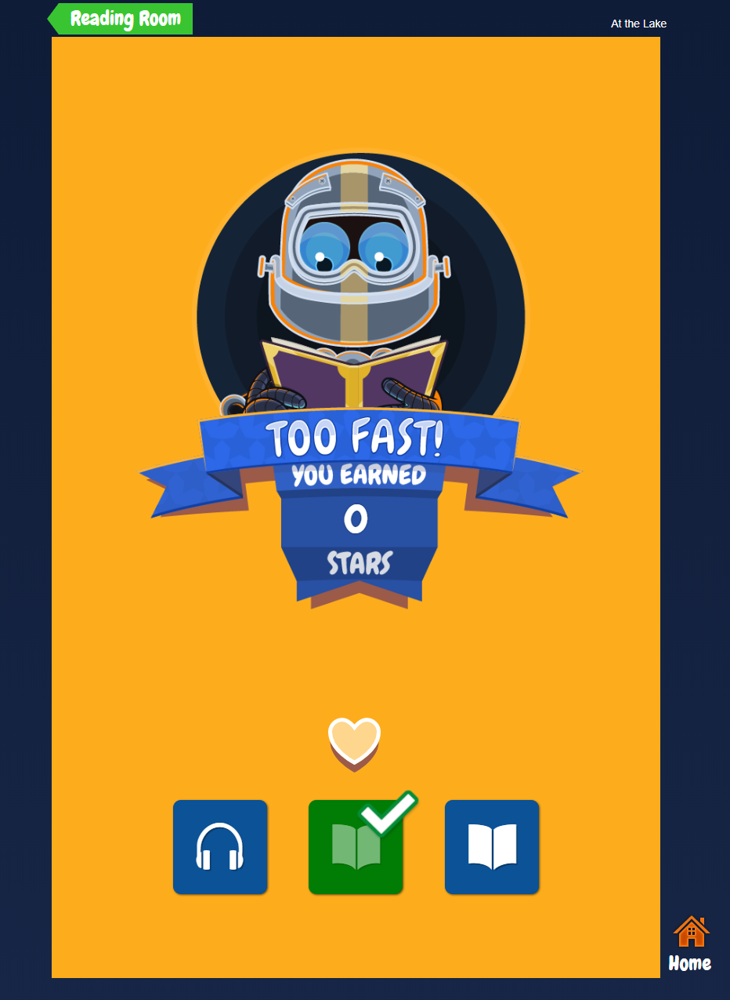
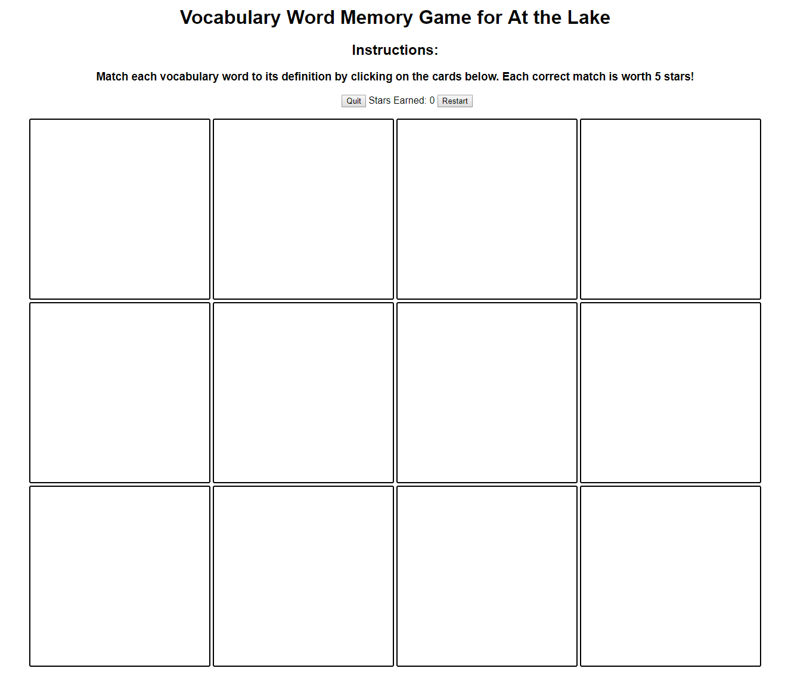
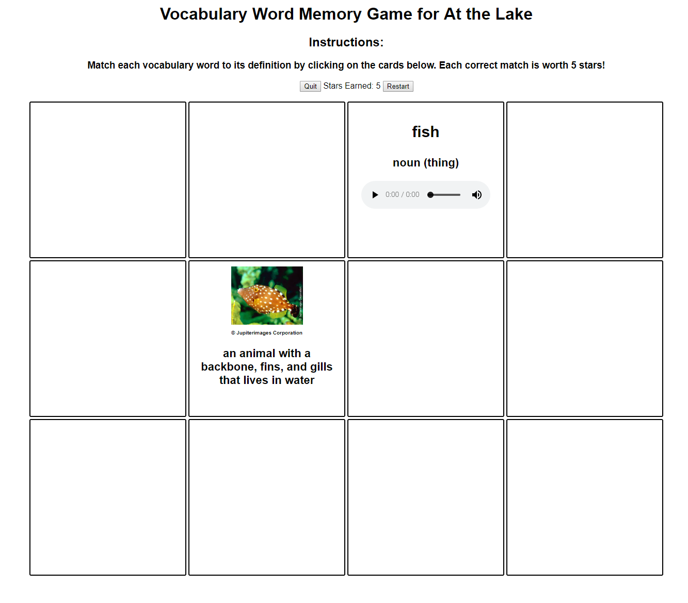
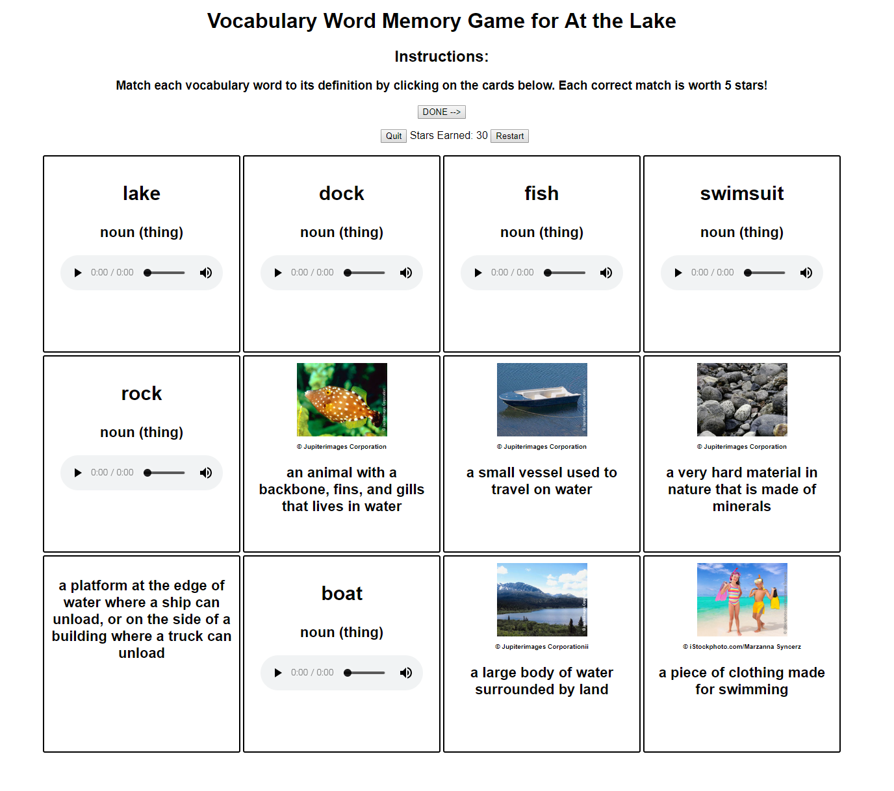
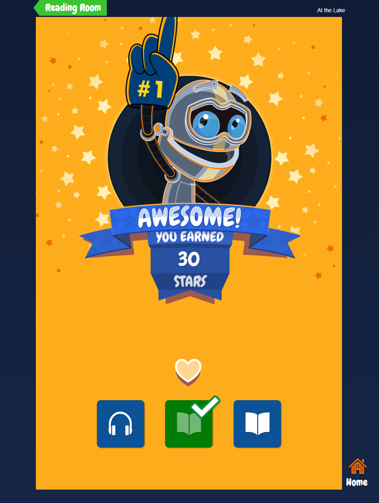

# Learning A-Z Intern Project: Vocabulary Memory Card Game

**Here is a link to the [plunker](https://next.plnkr.co/edit/4DoLn84ZcpY3WsUVkkZn?preview) for the game with hard-coded values.**

A student-facing memory card game that aims to help students learn vocabulary words from ebooks.

Students have the option to play the game when they have finished an ebook. The link to the game is only displayed if a game has been created for that ebook in the Content Management System (CMS). Currently, the link to the game is the rightmost book icon:

When a student clicks the link for the first time, they are taken to a blank memory game:

The cards are initialized with an ebook vocabulary word or its definition. The words/definitions have set locations, and are the same for all students. This makes saving student progress easier.

Students click cards two at a time to see the contents. The goal is to correctly identify all word/definition matches. Each correct match found is worth 5 stars. Here is what a correct match looks like:

When a correct match is found, it is saved to the memory_game_result_word table in the activity database. Now, if a student reloads or leaves the page, they can still come back to the page just as they left it. The correct match is left face up, but with the cards disabled. The student can still read the cards and listen to the audio, but clicking on the card will not flip it back over. They are now free to find other matches.

There is a restart button, and this can be hit at any time before all matches are found. Restart will complete the current game in memory_game_result table, then start a new one for the student. Game progress has been “archived”, so that it is available if teachers ever need to see it. On restart, all cards will be flipped over, and the student will see a blank board.

The “Stars Earned” on the page is bound to an Angular variable, but this only gets saved to the database when the game is over.

This is what the game looks like when it is completed:

The “DONE →” button that pops up at the top will record activity completion on click, and take the student to the Activity Reward page:

Here is the [plunker](https://next.plnkr.co/edit/4DoLn84ZcpY3WsUVkkZn?preview) for the Vocabulary Memory Card Game with hard-coded values.

## Game Creation for an Ebook (CMS)

See the "memoryGameManager" AngularJS module.

raz-kids CMS, in Reading/RAZ & RK Books: there is a “Memory Game” column that lists the presence of a game draft or active game on each leveled book. 

Clicking any of the three links (New Game, Activate/Remove Game Draft, View Active Game) will take the user to a view that contains three parts: Game Board Dimensions, Vocabulary Words, and options depending on the action.

* **New Game**: select vocabulary words to include, generate board dimensions based on the amount of words chosen, select board dimensions, save the game draft.

* **Activate/Remove Game Draft**: board dimensions and vocab words selected will be disabled and visible, for confirmation/activation of the game draft. Activating the draft will make it live for the students, and removing the draft will allow the editor to create a new one.

* **View Active Game**: same view as Activate/Remove Game Draft except only additional option is to Archive the Game.

## Memory Game Added as Activity

Established memory game as an activity type and set a format for the game in the Raz-Kids content database for the August 2018 release.

When a game draft is made active in the CMS, the resource activity is enabled using the format and activity type in the DB.

## Game Logic

See “vocabMemoryGame” angular module. The “clickCard” function in the Angular controller contains most of the game logic (flipping cards, identifying matches)

The “vocabData” service used in the vocabMemoryGame module makes api calls that go through the Kids A-Z router.

Currently, if a student clicks two cards and they are not a match, the student must click one of these cards again to flip both back over.

Students can flip over the first of two cards, then decide to put it face down again and move on.

Restart can be clicked at any point before all matches are found. Will create a new memory_game_result entry for the student.

Quit button can be hit at any time. Will take student back to the reading room.

## Saving Student Progress

Two tables were created in the activity database for the September release: one for saving student progress and the other for saving student game completion.

Saving progress keeps track of the matches that the student has found, so that they can stay identified upon reload of the page/exiting the game.

